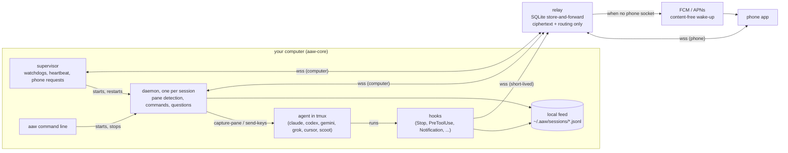
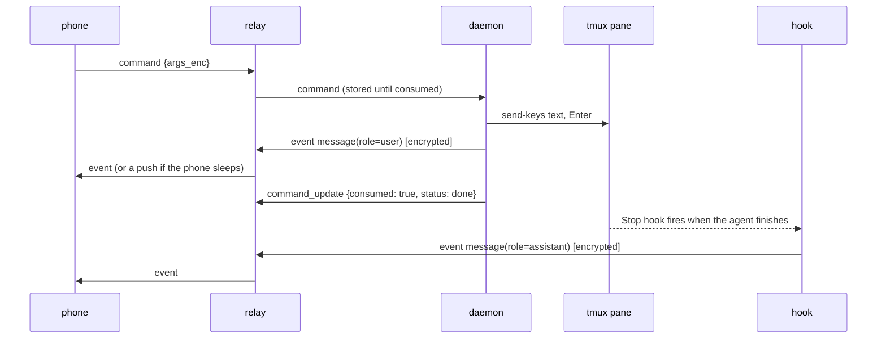

# Architecture

Everything runs on your computer except the relay, which sees only ciphertext and routing metadata.



## Pieces

| piece | module | runs as |
| --- | --- | --- |
| encryption | `aaw_core/encryption.py` | library |
| transport | `aaw_core/transport/` | library: the frame protocol client, one thread per connection |
| relay | `aaw_core/relay/` | `python -m aaw_core.relay` (Starlette + websockets + aiosqlite) |
| hooks | `aaw_core/hooks/` | `"<python>" -m aaw_core.hooks.<name>`, spawned by the agent |
| daemon | `aaw_core/daemon.py` | `python -m aaw_core.daemon --project-dir ... --project-id ... --agent ...` |
| host | `aaw_core/host/` | `aaw` (sessions, identity, supervisor, hooks installer, folder browser, services) |

## A prompt from the phone



## A permission prompt

The daemon reads the pane twice a second.
When it recognizes a permission prompt (or an AskUserQuestion, a multi-select, Cursor's native prompt) it writes a `question` event, sets the project `waiting`, and polls for an `answer` command whose `question_id` matches; the answer becomes key presses in the pane.
With `auto_approve` set on the project document, a yes/no prompt is answered "yes" on the computer without a round trip.
Hooks cover the same ground for agents whose PreToolUse hook can block (Claude Code, Codex, Gemini, scoot): `on_pre_tool` asks the phone and returns the decision to the agent.

## Identity and state

```
~/.aaw/
  host.json        computer id + relay routing token (0600)
  session.key      the AES key shared with the phone (0600)
  enabled          present while the supervisor runs; hooks and daemons are inert without it
  mobile_mode      "manual" or a timestamp: permission prompts go to the phone
  config.json      optional settings (relay_url, computer_name, browse_roots, ...)
  sessions/        the plaintext feed per session
  logs/            daemon.<id>.log, supervisor.log, hook logs
  run/             pid files
```

A session is identified by folder and agent (`aaw_core/host/session_id.py`): `proj` for the first agent on `~/proj`, `proj-codex` for a second one, `proj-<parent>` when another folder already owns the name.
The tmux session is `aaw-<id>`.
